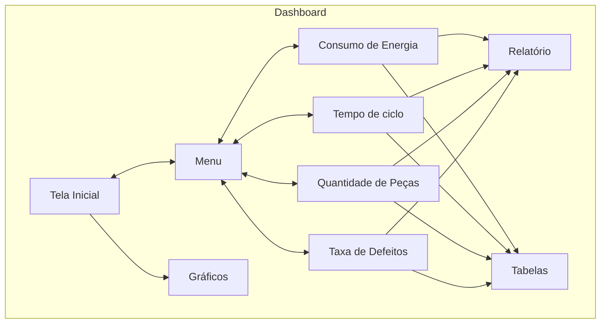
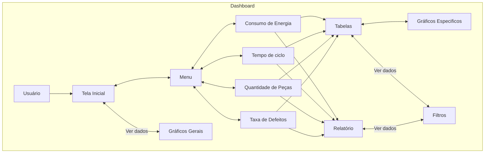

# PRD - Product Requirements Document (Template)

# *Introdução & objetivo*

Nosso sistema coleta dados em tempo real da sua linha de produção automotiva, garantindo armazenamento seguro e consultas rápidas. Com alertas inteligentes e automatização, você toma decisões ágeis, reduzindo custos e aumentando a eficiência, tudo com um ótimo custo-benefício para manter sua operação sempre fluindo.

# *Por que* implementar isto?

Implementar nosso sistema melhora o controle, reduz desperdícios e aumenta a eficiência da sua linha de produção. Com alertas inteligentes e automação, você antecipa problemas e mantém tudo em movimento, tudo isso com um excelente custo-benefício. É a solução perfeita para elevar a competitividade e a performance da sua operação.

---

# ***Público alvo***

Nosso produto foi desenvolvido para atender as exigências de gestores,  gerentes e engenheiros seja dos setores da Qualidade, como também de Operações.

| Perfil de usuário | Descrição, necessidades e interesses. |
| --- | --- |
| Gerentes | Acompanhamento da produção em tempo real, tempo de ciclo, gastos com defeitos e consumo    q   '   |
| Gestores | Acompanhamento de tempo de ciclo, percentual de defeitos e disperdicios de cada setor |
| Engenheiros | Acompanhamento de consumo energético e tempo de ciclo |

# *Personas*

1. **Gerente de Produção - Carla Moreira:**  Carla Moreira, com 20 anos de experiência, busca otimizar a produção automotiva e reduzir custos. Nosso sistema permite monitoramento em tempo real, armazenamento seguro de dados e automação, ajudando-a a antecipar problemas e tomar decisões estratégicas rapidamente.

2. **Gestor de Qualidade - Ricardo Santos**  Ricardo Santos, com 15 anos de experiência, garante que todos os produtos atendam aos padrões de qualidade. O sistema coleta dados em tempo real, oferece alertas para falhas e automatiza verificações, permitindo que Ricardo se concentre em melhorias contínuas.

3. **Engenheira de Produção - Luana Carvalho**  Luana Carvalho, com 8 anos de experiência, foca em automatizar e otimizar a linha de produção. Nosso sistema oferece dados rápidos, facilita a automação e justifica novos investimentos, ajudando Luana a implementar soluções eficientes e inovadoras.

---

# *Requisitos Funcionais*
## **Diagrama de Contexto**

[Os requisitos funcionais descrevem as funcionalidades e capacidades específicas que o produto deve ter. Eles detalham o que o sistema deve fazer, as interações com os usuários e outras partes do sistema.]

1. **Filtrar dados:** Capacidade de filtrar dados por data, crescentemente e decrescentemente. **P1**
2. **Consultar dados:** Consultar dados por meio de gráficos, tabelas e relatórios, possibilitando mostrar os dados de maneira dinâmica.**P1**
3. **Alertas inteligentes:** Disparar alertas ao se perceber que alguma métrica de monitoramento foi ultrapassada. **P2**

**P1** = **Crítico | P1 = Importante | P2 = Bom ter**

### *Caso de uso*
## **Diagrama Caso de Uso**

---

# *Requisitos Não Funcionais*

1. **Armazenamento de dados:** Capacidade de armazenar grandes volumes de dados. **P1**
2. **Confiabilidade:** Garantir o tráfego dos dados com segurança e integridade. **P1**
3. **Agilidade:** Garantir agilidade no processo de captura de dados em tempo real e no transporte destes. **P1**
4. **Escalabilidade:** Permitir que o sistema seja capaz de lidar com o aumento da quantidade de sensores e volume de dados. **P2**
5. **Documentação:** Documentar o código-fonte do projeto, para facilitar manutenções e atualizações futuras. **P1**

**P1** = **Crítico | P2 = Importante | P3 = Bom ter**

### 📊 Métricas
| Medida | Estado atual | Esperado | Resultados |
| --- | --- | --- | --- |
| Tempo de resposta | - | 3.5 segundos |  |
|  |  |  |  |
|  |  |  |  |

---

# *Fora de escopo*

<aside>
🚫 Liste todos os itens que estarão fora do escopo deste recurso do produto

</aside>

# *User Experience*

<aside>
🖍️ Crie links para seu arquivos de UX aqui: UX Flows, UI, etc.

</aside>

# *Dependências*

<aside>
⚠️ Quais necessidades que precisam ser supridas para que este produto/feature seja desenvolvido?

</aside>

# *Plano de lançamento*

*Crie uma lista de itens que precisão ser atendidos para o lançamento do produto no mercado, por exemplo:*

1. *Regras para lançamento interno:*
    - [ ]  *Validação*
    - [ ]  *Divulgação*

# 💌 *Plano de comunicação*

Quando as comunicações acontecerão? Quem será notificado sobre esse novo recurso? Enviaremos e-mails e notificações no aplicativo?

## *Links*
- [Miro](https://miro.com/app/board/uXjVKlCNuX4=/)