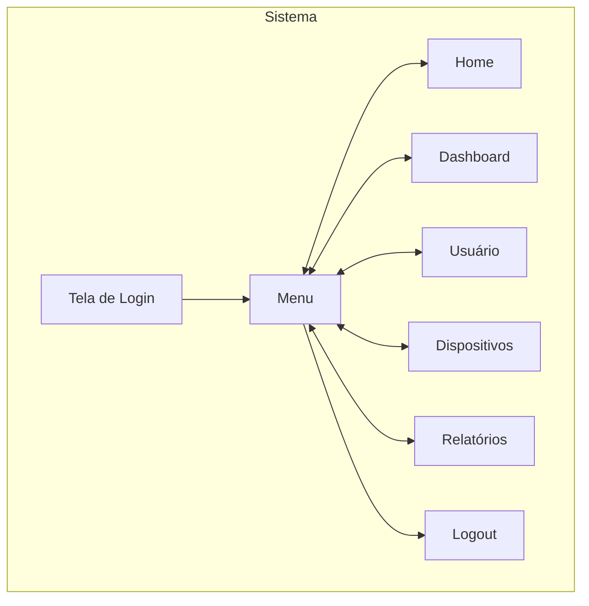
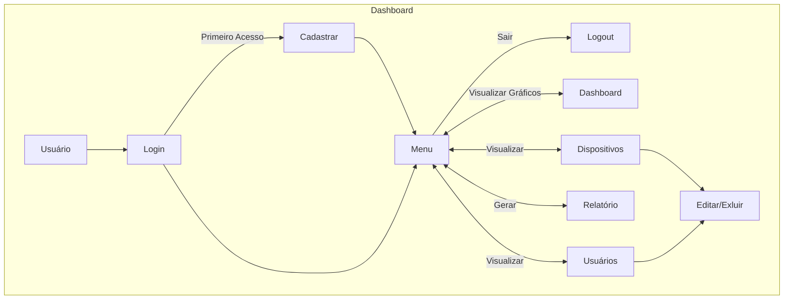

# PRD - Product Requirements Document (Template)

# *Introdução & objetivo*

Nosso sistema coleta dados em tempo real de uma plantação, sendo capaz de nos dizer a quantidade de vezes que a bomba foi acionada, quanto tempo durou esse acionamento e a umidade do solo. Assim, podemos ter um controle maior sobre o sistema de irrigação inteligente, permitindo obter *insights* importantes.

# *Por que* implementar isto?

A implementação de nosso sistema melhora a visibilidade do processo de irrigação inteligente, permitindo visualizar quais dias houve maior acionamento, quanto tempo durou a irrigação, além de favorecer o armazenamento de dados para análises futuras. Além disso, a escalabilidade do sistema é uma realidade, pois ele foi desenvolvido para pequenas, médias e grandes plantações, permitindo o cadastro de diversos sensores e bombas.

---

# ***Público alvo***

Nosso produto foi desenvolvido para atender as exigências de agricultores, fazendeiros e jardineiros.

| Perfil de usuário | Descrição, necessidades e interesses. |
| --- | --- |
| Agricultores | Acompanhamento de dados referentes a irrigação e análise de qualidade da umidade no solo |
| Fazendeiros | Acompanhamento de dados referentes a irrigação e obtenção de possíveis *insights* |
| Jardineiros | Acompanhamento de quantas vezes foi necessário irrigar determinadas áreas |

# *Personas*

1. **Agricultor - João:**  Agricultor que busca otimizar o uso de água e melhorar a produtividade das lavouras por meio do monitoramento preciso da irrigação e da qualidade da umidade do solo. 
2. **Fazendeiro - Vitor:**  Fazendeiro de grande porte interessado em *insights* sobre a irrigação para melhorar a eficiência da operação, reduzir custos e escalar o sistema conforme a fazenda cresce.
3. **Jardineira - Kelly:**  Jardineira urbana que deseja monitorar de maneira simples e eficiente a irrigação de diferentes áreas do jardim, garantindo a saúde das plantas com o mínimo de esforço.
---

# *Requisitos Funcionais*
## **Diagrama de Contexto**

1. **Gerar Relatórios:** Capacidade de gerar relatórios contendo dados do sistema. **P1**
2. **Consultar dados:** Consultar dados por meio de gráficos em Dashboard e relatórios, possibilitando mostrar os dados de maneira dinâmica.**P1**
3. **Cadastrar Usuários:** Cadastrar usuários no sistema de maneira eficiente e segura**P2**
4. **Cadastrar Dispositivos:** Cadastrar dispositivos no sistema, como sensores e bombas**P2**

**P1** = **Crítico | P1 = Importante | P2 = Bom ter**

### *Caso de uso*
## **Diagrama Caso de Uso**

---

# *Requisitos Não Funcionais*

1. **Armazenamento de dados:** Capacidade de armazenar grandes volumes de dados. **P1**
2. **Confiabilidade:** Garantir o tráfego dos dados com segurança e integridade. **P1**
3. **Agilidade:** Garantir agilidade no processo de captura de dados em tempo real e no transporte destes. **P1**
4. **Escalabilidade:** Permitir que o sistema seja capaz de lidar com o aumento da quantidade de sensores e volume de dados. **P2**
5. **Documentação:** Documentar o código-fonte do projeto, para facilitar manutenções e atualizações futuras. **P1**

**P1** = **Crítico | P2 = Importante | P3 = Bom ter**

### 📊 Métricas
| Medida | Estado atual | Esperado | Resultados |
| --- | --- | --- | --- |
| Tempo de resposta | - | 2.0 segundos |  |
|  |  |  |  |
|  |  |  |  |

---

# *Fora de escopo* 🚫

Embora o sistema seja projetado para coletar dados em tempo real relacionados à operação da irrigação, não será contemplado neste escopo análise de métricas relacionadas ao estado dos dispositivos, tais como:

- Temperatura dos componentes da bomba
- Indicadores de desgaste ou eficiência operacional
- Manutenção preventiva baseada no estado dos dispositivos
- Cálculo de Gasto de Energia

</aside>

# *User Experience*

<aside>
🖍️ Crie links para seu arquivos de UX aqui: UX Flows, UI, etc.

</aside>

# *Dependências*

## Frontend
- **Next.js:** Framework para construção da interface web do sistema com suporte a SSR e SPA, garantindo desempenho e SEO.
- **TypeScript:** Superset do JavaScript que permite tipagem estática, aumentando a segurança e a manutenibilidade do código.
- **TailwindCSS:** Framework de CSS utilitário que acelera o desenvolvimento de interfaces consistentes e responsivas.
- **React:** Biblioteca JavaScript para construção de interfaces de usuário interativas e escaláveis.

## Backend
- **C#:** Linguagem de programação usada para a lógica de negócios e integração backend.
- **.Net Core e ASP.NET:** Frameworks robustos para o desenvolvimento de APIs e serviços backend escaláveis.

## Banco de Dados
- **SQLite:** Banco de dados leve e portátil usado para armazenar dados locais em dispositivos menores.

## Ferramentas para Desenvolvimento

- **Visual Studio Code/Visual Studio:** IDEs para o desenvolvimento.
- **Postman/Swagger:** Teste e documentação de APIs.

 
<aside>

⚠️ Quais necessidades que precisam ser supridas para que este produto/feature seja desenvolvido?

</aside>

# *Plano de lançamento*
1. *Regras para lançamento interno:*
    - [ ]  *Desenvolvimento*
    - [ ]  *Integração*
    - [ ]  *Validação*
    - [ ]  *Divulgação*

# 💌 *Plano de comunicação*

Inicialmente, apresentaremos nosso sistema em fase Beta a comunidade do Senai. Logo depois, os anúncios do lançamento serão enviados aos principais interessados que se inscreveram para serem os primeiros a testar e desfrutar do produto.

## *Links*
- [Miro](https://miro.com/app/board/uXjVKlCNuX4=/)
