# PRD - Product Requirements Document (Template)

# *Introdução & objetivo*

Nosso sistema coleta dados em tempo real de uma plantação, sendo capaz de nos dizer a quantidade de vezes que a bomba foi acionada, quanto tempo durou esse acionamento e a umidade do solo. Assim, podemos ter um controle maior sobre o sistema de irrigação inteligente, permitindo obter *insights* importantes.

# *Por que* implementar isto?

A implementação de nosso sistema melhora a visibilidade do processo de irrigação inteligente, permitindo visualizar quais dias houve maior acionamento, quanto tempo durou a irrigação, além de favorecer o armazenamento de dados para análises futuras. Além disso, a escalabilidade do sistema é uma realidade, pois ele foi desenvolvido para pequenas, médias e grandes plantações, permitindo o cadastro de diversos sensores e bombas.

---

# ***Público alvo***

Nosso produto foi desenvolvido para atender as exigências de agricultores, fazendeiros e jardineiros.

| Perfil de usuário | Descrição, necessidades e interesses. |
| --- | --- |
| Agricultores | Acompanhamento de dados referentes a irrigação e análise de qualidade da umidade no solo |
| Fazendeiros | Acompanhamento de dados referentes a irrigação e obtenção de possíveis *insights* |
| Jardineiros | Acompanhamento de quantas vezes foi necessário irrigar determinadas áreas |

# *Personas*

1. **Agricultor - João:**  Agricultor que busca otimizar o uso de água e melhorar a produtividade das lavouras por meio do monitoramento preciso da irrigação e da qualidade da umidade do solo. 
2. **Fazendeiro - Vitor:**  Fazendeiro de grande porte interessado em *insights* sobre a irrigação para melhorar a eficiência da operação, reduzir custos e escalar o sistema conforme a fazenda cresce.
3. **Jardineira - Kelly:**  Jardineira urbana que deseja monitorar de maneira simples e eficiente a irrigação de diferentes áreas do jardim, garantindo a saúde das plantas com o mínimo de esforço.
---

# *Requisitos Funcionais*
## **Diagrama de Contexto**

```mermaid
graph TB
    subgraph Dashboard
        L[Tela de Login]
        C[Home]
        A[Dashboard]
        I[Menu]
        F[Usuário]
        D[Dispositivos]
        R[Relatórios]
        O[Logout]

        L-->I
        I<-->C
        I<-->A
        I<-->F
        I<-->D
        I<-->R
        I-->O
        
    
      
    end
```

1. **Gerar Relatórios:** Capacidade de gerar relatórios contendo dados do sistema. **P1**
2. **Consultar dados:** Consultar dados por meio de gráficos, tabelas e relatórios, possibilitando mostrar os dados de maneira dinâmica.**P1**
3. **Cadastrar Usuários:** Cadastrar usuários no sistema de maneira eficiente e segura**P2**
4. **Cadastrar Dispositivos:** Cadastrar dispositivos no sistema como sensores e bombas**P2**

**P1** = **Crítico | P1 = Importante | P2 = Bom ter**

### *Caso de uso*
## **Diagrama Caso de Uso**

```mermaid
graph TB
    subgraph Dashboard
        A[Menu]
        F[Dashboard]
        B[Gráficos]
        C[Tempo de ciclo]
        D[Quantidade de Peças]
        E[Consumo de Energia]
        R[Relatório]
        I[Filtros]
        G[Usuário]
        H[Login]
        K[Cadastrar]
        O[Logout]

        G-->H
        H-->|Primeiro Acesso|K
        K-->A
        A-->|Sair|O
        H-->A
        A<-->F
        F<-->|Visualizar|B
        T<-->|Ver dados|I
        R<-->|Ver dados|I      
    end
```

---

# *Requisitos Não Funcionais*

1. **Armazenamento de dados:** Capacidade de armazenar grandes volumes de dados. **P1**
2. **Confiabilidade:** Garantir o tráfego dos dados com segurança e integridade. **P1**
3. **Agilidade:** Garantir agilidade no processo de captura de dados em tempo real e no transporte destes. **P1**
4. **Escalabilidade:** Permitir que o sistema seja capaz de lidar com o aumento da quantidade de sensores e volume de dados. **P2**
5. **Documentação:** Documentar o código-fonte do projeto, para facilitar manutenções e atualizações futuras. **P1**

**P1** = **Crítico | P2 = Importante | P3 = Bom ter**

### 📊 Métricas
| Medida | Estado atual | Esperado | Resultados |
| --- | --- | --- | --- |
| Tempo de resposta | - | 3.5 segundos |  |
|  |  |  |  |
|  |  |  |  |

---

# *Fora de escopo*

<aside>
🚫 Liste todos os itens que estarão fora do escopo deste recurso do produto

</aside>

# *User Experience*

<aside>
🖍️ Crie links para seu arquivos de UX aqui: UX Flows, UI, etc.

</aside>

# *Dependências*

<aside>
⚠️ Quais necessidades que precisam ser supridas para que este produto/feature seja desenvolvido?

</aside>

# *Plano de lançamento*

*Crie uma lista de itens que precisão ser atendidos para o lançamento do produto no mercado, por exemplo:*

1. *Regras para lançamento interno:*
    - [ ]  *Validação*
    - [ ]  *Divulgação*

# 💌 *Plano de comunicação*

Quando as comunicações acontecerão? Quem será notificado sobre esse novo recurso? Enviaremos e-mails e notificações no aplicativo?

## *Links*
- [Miro](https://miro.com/app/board/uXjVKlCNuX4=/)