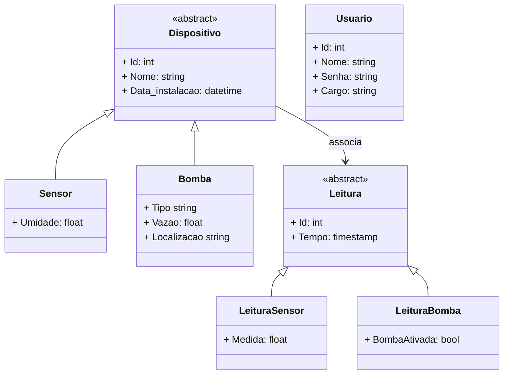
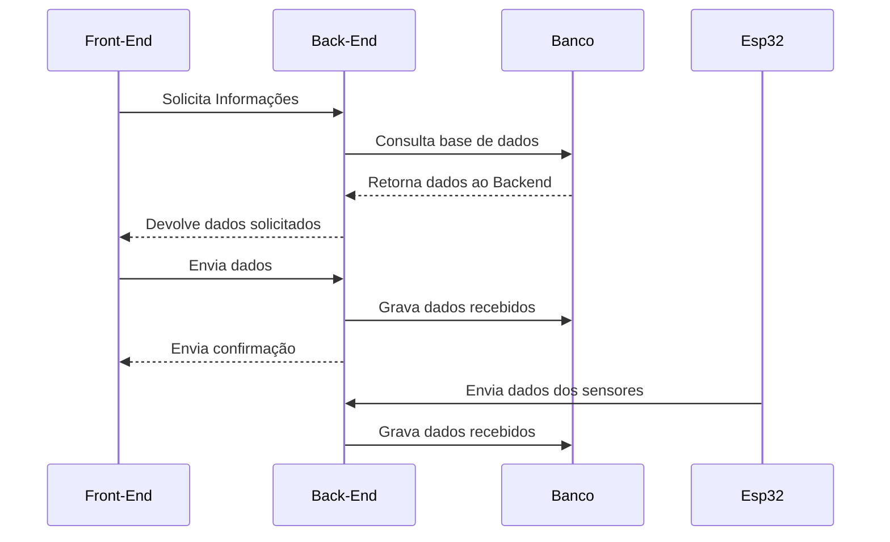

# Irrigação Smart

## Overview
> Nosso projeto foi desenvolvido em conjunto com um grupo de mecatrônica, com o objetivo de criar um sistema completo de irrigação inteligente. A nossa aplicação foi construída com foco na análise e armazenamento de dados, permitindo visualizar de forma simples e objetiva as informações provenientes do microcontrolador ESP32, responsável por gerenciar toda a parte de irrigação por meio de bombas e pelo monitoramento da umidade do solo, através de sensores.

## Índice

- [Objetivo](#objetivo)
- [Tecnologias e Dependências](#tecnologias-e-dependências)
- [Instalação](#instalação)
- [Uso](#uso)
- [Autor](#autor)

## Objetivo

Nosso sistema é capaz de receber dados enviados pelo microcontrolador e armazená-los em um banco de dados relacional, além de apresentá-los na interface gráfica do usuário. Seu principal objetivo foi proporcionar uma visualização fácil dos dados, o gerenciamento e o cadastro de usuários no sistema, assim como o registro de dispositivos.

Exemplo:

- **Objetivo:** Este projeto facilita a integração entre sistemas X e Y, permitindo a automação de tarefas e a comunicação entre plataformas de forma simples e eficiente.

## Tecnologias e Dependências

Este projeto foi desenvolvido utilizando as seguintes tecnologias e bibliotecas:

- **Linguagens e Frameworks:**
  - [Linguagem de Programação] (ex: Python, JavaScript, Java)
  - [Framework] (ex: Flask, React, Spring Boot)

- **Dependências principais:**
  - `nome-da-dependencia` - Descrição breve (ex: biblioteca para manipulação de data)
  - `outro-pacote` - Descrição breve

### Como instalar as dependências

Para instalar as dependências do projeto, basta rodar o seguinte comando:

# Diagrama de Classes

# Diagrama de Sequência

