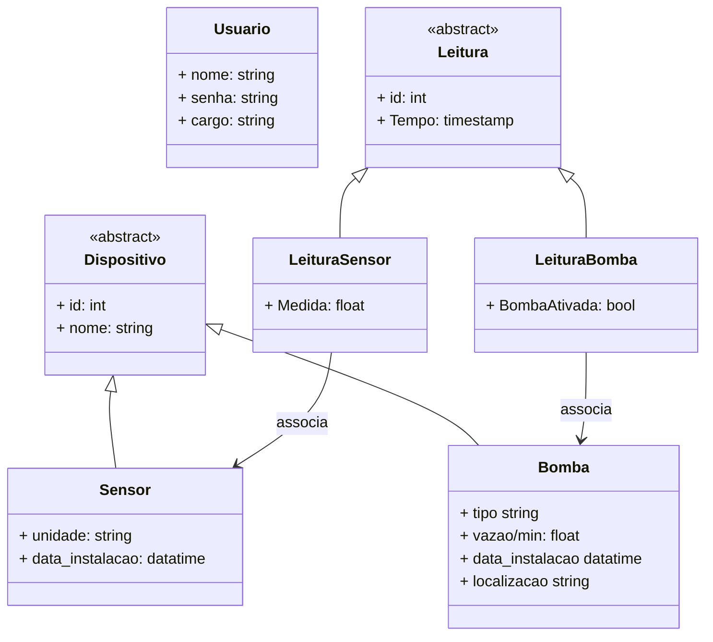

# DIAGRAMA DE CLASSES

```mermaid
classDiagram
    class Dispositivo {
        <<abstract>>
        + id: int
        + nome: string
    }
    class Usuario {
        + nome: string
        + senha: string
        + cargo: string
    }


    class Sensor {
        + unidade: string
        + data_instalacao: datatime
    }
    class Bomba {
        + tipo string
        + vazao/min: float
        + data_instalacao datatime
        + localizacao string
    }
    class Leitura {
        <<abstract>>
        + id: int
        + Tempo: timestamp
    }
    class LeituraBomba {
        + BombaAtivada: bool
    }
    class LeituraSensor {
        + Medida: float
    }

    Usuario
    
    Dispositivo  <|-- Sensor
    Dispositivo <|-- Bomba

    Leitura <|-- LeituraSensor
    Leitura <|-- LeituraBomba

    LeituraBomba --> Bomba : associa
    LeituraSensor --> Sensor : associa
```