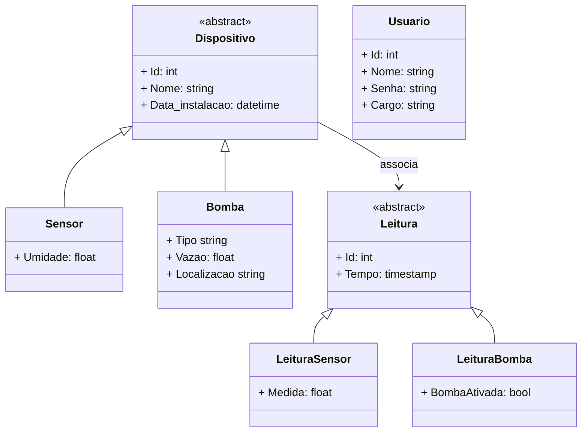
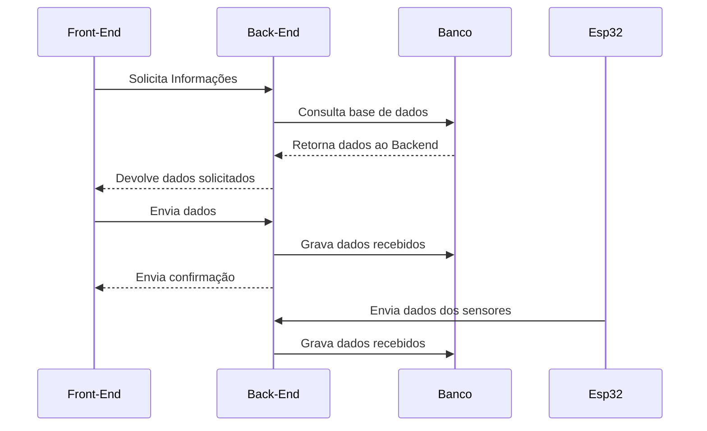

# Diagrama de Classes

```mermaid
classDiagram
    class Dispositivo {
        <<abstract>>
        + Id: int
        + Nome: string
        + Data_instalacao: datetime
    }
    class Usuario {
        + Id: int
        + Nome: string
        + Senha: string
        + Cargo: string
    }


    class Sensor {
        + Umidade: float
    }
    class Bomba {
        + Tipo string
        + Vazao: float
        + Localizacao string

    }
    class Leitura {
        <<abstract>>
        + Id: int
        + Tempo: timestamp
    }
    class LeituraBomba {
        + BombaAtivada: bool
    }
    class LeituraSensor {
        + Medida: float
    }

    Usuario
    
    Dispositivo  <|-- Sensor
    Dispositivo <|-- Bomba

    Leitura <|-- LeituraSensor
    Leitura <|-- LeituraBomba

    Dispositivo --> Leitura : associa
```

# Diagrama de Sequência

```mermaid
sequenceDiagram
    participant Front-End
    participant Back-End
    participant Banco
    participant Esp32

    Front-End->>Back-End: Solicita Informações
    Back-End->>Banco: Consulta base de dados
    Banco-->>Back-End: Retorna dados ao Backend
    Back-End-->>Front-End: Devolve dados solicitados
    
    Front-End->>Back-End: Envia dados
    Back-End->>Banco: Grava dados recebidos
    Back-End-->>Front-End: Envia confirmação

    Esp32->>Back-End: Envia dados dos sensores
    Back-End->>Banco: Grava dados recebidos
    
```
