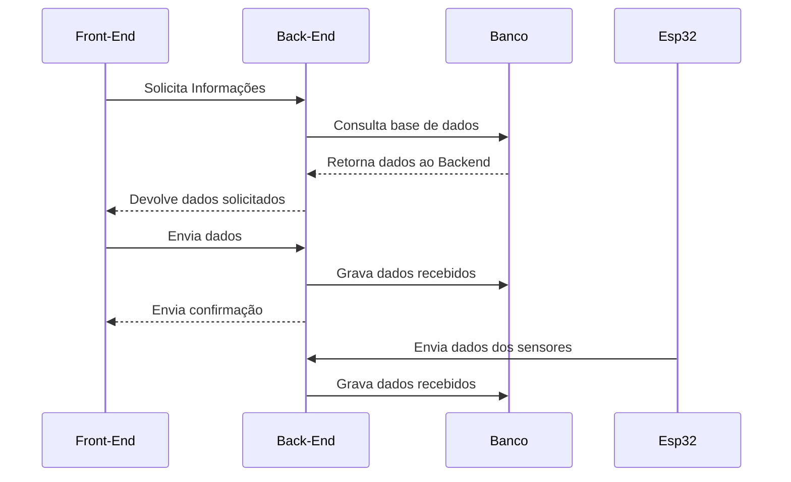

# Irrigação Smart

## Overview
> Nosso projeto foi desenvolvido em conjunto com um grupo de mecatrônica, com o objetivo de criar um sistema completo de irrigação inteligente. A nossa aplicação foi construída com foco na análise e armazenamento de dados, permitindo visualizar de forma simples e objetiva as informações provenientes do microcontrolador ESP32, responsável por gerenciar toda a parte de irrigação por meio de bombas e pelo monitoramento da umidade do solo, através de sensores.


## Índice

- [Objetivo](#objetivo)
- [Tecnologias e Dependências](#tecnologias-e-dependências)
- [Instalação](#instalação)
- [Uso](#uso)
- [Autores](#autores)

## Objetivo

Nosso sistema é capaz de receber dados enviados pelo microcontrolador e armazená-los em um banco de dados relacional, além de apresentá-los na interface gráfica do usuário. Seu principal objetivo foi proporcionar uma visualização fácil dos dados, o gerenciamento e o cadastro de usuários no sistema, assim como o registro de dispositivos.

Ao implementá-lo, garantiremos que os dados da plantação sejam armazenados no banco de dados, facilitando futuras análises. Além disso, como nosso sistema obtém dados em tempo real, o usuário poderá acompanhar o estado da plantação, o que possibilitará a identificação de problemas e irregularidades. 

## Tecnologias e Dependências

Este projeto foi desenvolvido utilizando as seguintes tecnologias e bibliotecas:

- **Frameworks:**
  - `.Net Core`
  - `React.js`
  - `Next.js`
  - `TailwindCSS`
- **Linguagens:**
  - `TypeScript`
  - `C#`

- **Dependências principais:**
  - `Axios` - Usada para fazer requisições a API Back-end
  - `Entity Framework Core` - Ferramenta ORM
  - `Prime React` 
## Como instalar as dependências

Para baixar o projeto e instalar as dependências:

Garanta que o `.Net Core SKD` e o `Node.js` estão instalados:
```bash
node -v && npm -v
dotnet --version
```

Rode o script `start-app.sh`
```bash
 ./start-app.sh
```

## Uso
O diagrama a seguir explica, em forma de sequências, o fluxo de como o sistema deve funcionar. Consideramos apenas o Front-End, o Back-End, o Banco de Dados e o ESP32 (sistema da mecatrônica):

### Diagrama de Sequência



Todas as ações disponíveis na interface do usuário são definidas no Front-End. A gestão do banco de dados e o processamento das requisições vindas do usuário e do microcontrolador são realizados no Back-End. Já a emissão dos dados obtidos pelos sensores do sistema de irrigação é gerenciada pelo ESP32.

## Autores
<div align="center">
<table>
  <tr>
    <td align="center">
      <a href="https://github.com/GBrizola">
        <br>
        <sub>
          <b>Gabriel Brizola</b>
        </sub>
      </a>
    </td>
    <td align="center">
      <a href="https://github.com/Henferper">
        <br>
        <sub>
          <b>Henrique Fernandes</b>
        </sub>
      </a>
    </td>
    <td align="center">
      <a href="https://github.com/Giovani-RodriguesS">
        <br>
        <sub>
          <b>Giovani Rodrigues</b>
        </sub>
      </a>
    </td>
    <td align="center">
      <a href="https://github.com/rafael-rodrigues01">
        <br>
        <sub>
          <b>Rafael Rodrigues</b>
        </sub>
      </a>
    </td>
    <td align="center">
      <a href="https://github.com/Anhaia09">
        <br>
        <sub>
          <b>Letícia Anhaia</b>
        </sub>
      </a>
    </td>
    <td align="center">
      <a href="https://github.com/GabrielPerosa">
        <br>
        <sub>
          <b>Gabriel Perosa</b>
        </sub>
      </a>
    </td>
    
  </tr>
</table>
</div>
