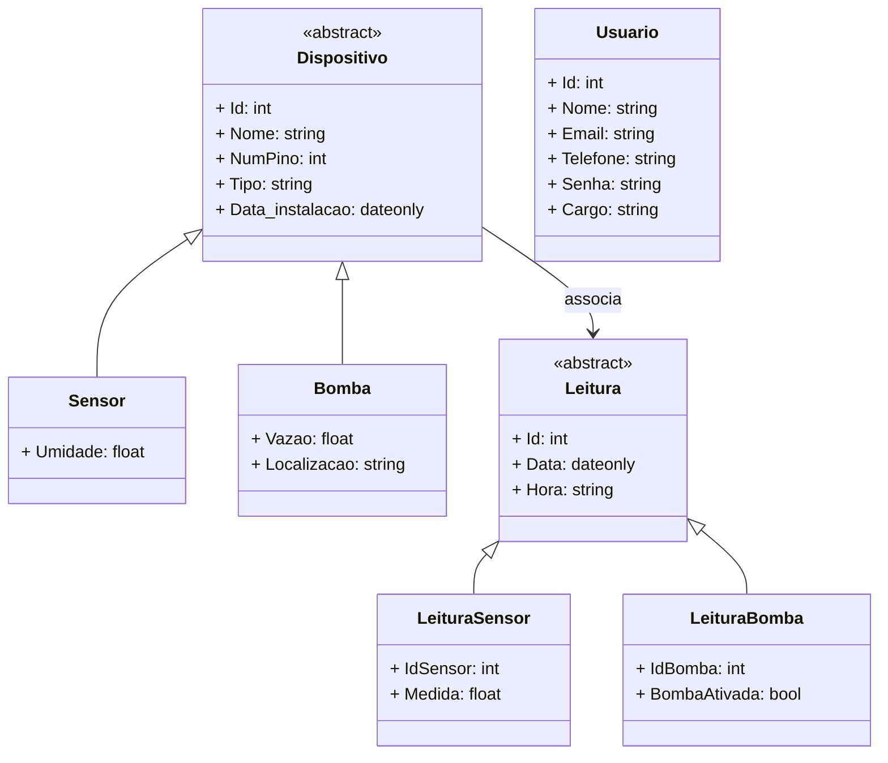

```mermaid
classDiagram
    class Dispositivo {
        <<abstract>>
        + Id: int
        + Nome: string
        + NumPino: int
        + Tipo: string
        + Data_instalacao: dateonly
    }
    class Usuario {
        + Id: int
        + Nome: string
        + Email: string
        + Telefone: string
        + Senha: string
        + Cargo: string
    }


    class Sensor {
        + Umidade: float
    }
    class Bomba {
        + Vazao: float
        + Localizacao: string

    }
    class Leitura {
        <<abstract>>
        + Id: int
        + Data: dateonly
        + Hora: string
    }
    class LeituraBomba {
        + IdBomba: int
        + BombaAtivada: bool
    }
    class LeituraSensor {
        + IdSensor: int
        + Medida: float
    }

    Usuario
    
    Dispositivo  <|-- Sensor
    Dispositivo <|-- Bomba

    Leitura <|-- LeituraSensor
    Leitura <|-- LeituraBomba

    Dispositivo --> Leitura : associa
```
